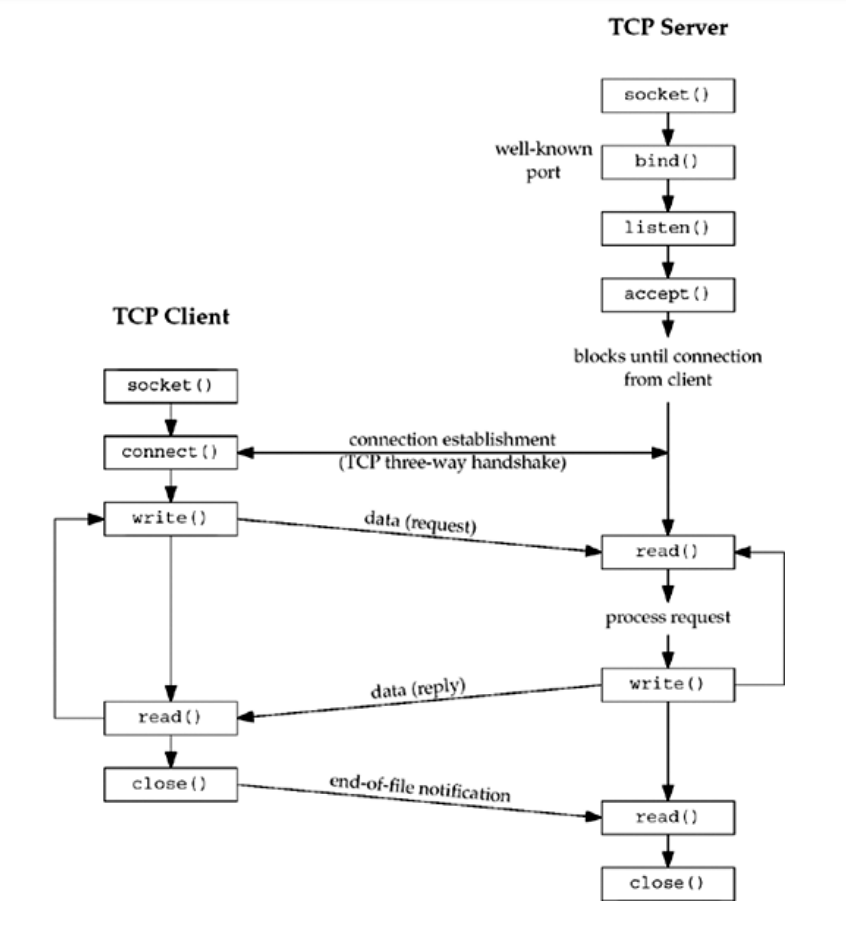
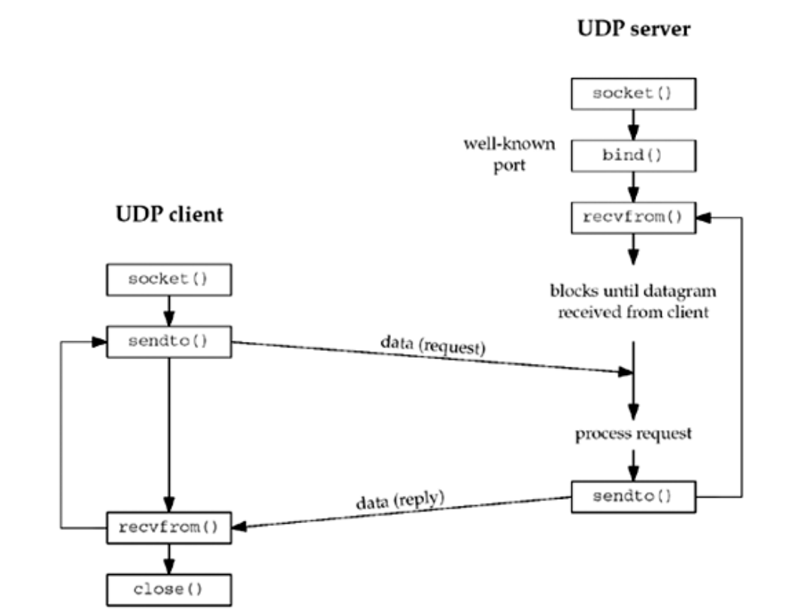

# Spis treści

- [Zadanie 1](#zadanie-1)
- [Zadanie 2](#zadanie-2)
- [Zadanie 3](#zadanie-3)
- [Zadanie 4](#zadanie-4)

***

# Zadanie 1

### Na podstawie §4.1 i §8.1 książki *„Unix Network Programming: The Sockets Networking API”* przedstaw diagram komunikacji klient-serwer za pomocą protokołu TCP i UDP z użyciem, odpowiednio, interfejsu <u>*gniazd strumieniowych*</u> i <u>*datagramowych*</u>.

**gniazda strumieniowe** – gniazda oparte na połączeniach. Umożliwiają sekwencjonowany przepływ danych z gwarancją przesłania pakietu i zachowania kolejności.
**gniazda datagramowe** – gniazda działające bez połączenia. Każdy przsyłany przez nie pakiet jest indywidualnie adresowany i przekierowywany. Nie daje gwarancji przesłania pakietu ani zachowania kolejności.



1) Serwer jest uruchamiany. Tworzy gniazdo i oczekuje na połączenia.
2) Klient jest uruchamiany i próbuje połączyć się z serwerem
3) Klient wysyła żądania do serwera, który mu odpowiada, dopóki klient nie zamknie połączenia.



1) Klient nie tworzy połączenia z serwerem, zamiast tego wysyła datagram do serwera używając funkcji `sendto`, która wymaga docelowego adresu jako parametru.
2) Serwer nie tworzy połączenia z klientem, zamiast tego używa funkcji `recvfrom`, która zwraca protokół klienta razem z datagramem.


###  Która ze stron komunikacji używa <u>*portów ulotnych*</u> (ang. *ephemeral*)?

**porty ulotne** – tymczasowe porty przydzielane automatycznie klientowi. Istnieją tylko na czas trwania połączenia. Po jego zakończeniu port staje się dostępny do ponownego użycia.

Porty ulotne używane są przez klienta.


### Czemu w przypadku protokołu UDP do komunikacji należy używać wywołań systemowych [recvfrom(2)](http://man7.org/linux/man-pages/man2/recvfrom.2.html) i [sendto(2)](http://man7.org/linux/man-pages/man2/sendto.2.html) (o ile wcześniej nie wykonano [connect(2)](http://man7.org/linux/man-pages/man2/connect.2.html)) zamiast [read(2)](http://man7.org/linux/man-pages/man2/read.2.html) i [write(2)](http://man7.org/linux/man-pages/man2/write.2.html)?

Należy używać wywołań `recfrom()` i `sendto()`, gdyż w przypadku protokołu UDP trzeba odczytać z jakiego adresu przyszły pakiety a następnie wysłać je do konkretnego adresu a wywołania `read()` i `write()` tego nie umożliwiają.

***

# Zadanie 2

### Zmodyfikuj program [hostinfo.c](./programy/hostinfo.c) w taki sposób, aby wyświetlał zarówno adresy IPv4, jak i IPv6 dla danej nazwy serwera. Dodatkowo należy przekształcić nazwę usługi przekazanej jako opcjonalny trzeci parametr programu na numer portu. Co należałoby zrobić, żeby program rozpoznawał usługę o nazwie `tftp`?

Rozwiązanie: [hostinfo.c](./programy/hostinfo.c)

Żeby program rozpoznawał usługę `tftp` należy zmienić rodzaj gniazda na 0.

***

# Zadanie 3

### Zapoznaj się z kodem źródłowym serwera [echoserver.c](./programy/echoserver.c) i klienta [echoclient.c](./programy/echoclient.c) usługi podobnej do `echo`. Twoim zadaniem jest taka modyfikacja serwera, by po odebraniu sygnału `SIGINT` wydrukował liczbę bajtów odebranych od wszystkich klientów, po czym zakończył swe działanie.

Rozwiązanie: [echoserver.c](./programy/echoserver.c)


### Używając programu `watch` uruchom polecenie `netstat -ptn`, aby obserwować stan połączeń sieciowych. Wystartuj po jednym procesie serwera i klienta. Wskaż na wydruku końce połączenia należące do serwera i klienta. Następnie wystartuj drugą instancję klienta. Czemu nie zachowuje się ona tak samo jak pierwsza? Co zmieniło się na wydruku z `netstat`?

```bash
# wszystko w oddzielnych terminalach
watch netstat -ptn
./echoserver 2137 
./echoclient localhost 2137
./echoclient localhost 2137
```

Druga instancja nie zachowuje się tak jak pierwsza, gdyż serwer jest w stanie obsługiwać jedynie jednego klienta jednocześnie (reszta czeka w kolejce na połączenie). Kiedy pierwszy klient zamknie połączenie, to drugi połączy się z serwerem.

Jeden klient:
```
tcp        0      0 127.0.0.1:2137          127.0.0.1:40792         ESTABLISHED 20097/./echoserver
tcp        0      0 127.0.0.1:40792         127.0.0.1:2137          ESTABLISHED 20157/./echoclient
```
Dwóch klientów:
```
tcp        0      0 127.0.0.1:40798         127.0.0.1:2137          ESTABLISHED 20274/./echoclient
tcp        0      0 127.0.0.1:2137          127.0.0.1:40792         ESTABLISHED 20097/./echoserver
tcp        0      0 127.0.0.1:40792         127.0.0.1:2137          ESTABLISHED 20157/./echoclient
```

Na wydruku pojawiło się połączenie z klienta 40798 do serwera, ale serwer jest połączony jedynie z klientem 40792.

***

# Zadanie 4

### Serwer z poprzedniego zadania nie radził sobie ze współbieżną obsługą wielu połączeń. Serwer z pliku «echoclient-fork.c» naprawia to poważne ograniczenie z użyciem wywołania `fork`. Zadaniem głównego procesu jest odbieranie połączeń i delegowanie ich obsługi do podprocesów. Proces serwera musi zliczać liczbę bajtów odebranych od klientów. W tym celu przydziela dzieloną pamięć anonimową, w której przechowuje tablicę `client`. Przy starcie podprocesu umieszcza w tablicy odpowiedni wpis za pomocą procedury `addclient`. Żeby uniknąć wyścigów każdy podproces zwiększa własny licznik `nread`. Po zakończeniu podprocesu należy wywołać procedurę `delclient`, która doda zawartość prywatnego licznika klienta, do globalnego licznika serwera. W dowolnym momencie działanie serwera może zostać przerwane przy pomocy sygnału `SIGINT`. Należy wtedy poczekać na zakończenie podprocesów i wydrukować zawartość globalnego licznika serwera.

Rozwiązanie: [echoserver-fork.c](./programy/echoserver-fork.c)
***
