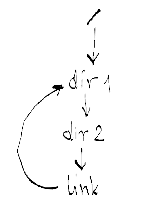

# Spis treści

- [Zadanie 1](#zadanie-1)
- [Zadanie 3](#zadanie-3)
- [Zadanie 4](#zadanie-4)

***

# Zadanie 1

### Czym różnią się ścieżka *absolutna*, *relatywna* i *znormalizowan*a?

- **ścieżka absolutna** – wskazuje na ten sam plik niezależnie od aktualnego katalogu roboczego (zaczyna się katalogiem *root*a).
- **ścieżka relatywna** – wskazuje na lokalizację względem aktualnego katalogu roboczego.
- **ścieżka znormalizowana** – (*??? jedyne co znalazłem to [coś](https://blogs.msdn.microsoft.com/jeremykuhne/2016/04/21/path-normalization/) na (tfu) Windowsie*) ścieżka bez `.` , `..` + bez końcowych białych znaków.

### Względem którego katalogu obliczana jest ścieżka relatywna? Jakim wywołaniem systemowym zmienić ten katalog?

Ścieżka relatywna obliczana jest względem aktualnego katalogu roboczego (*current working directory*).

Można zmienić ten katalog wywołąniem [`chdir(2)`](https://linux.die.net/man/2/chdir).

### Wyjaśnij czym są *punkty montażowe*, a następnie na podstawie [mount(8)](https://www.freebsd.org/cgi/man.cgi?mount(8)) wyjaśnij znaczenie i zastosowanie następujących atrybutów punktów montażowych: `noatime`, `noexec` i `sync`.

**punkt montażowy** (ang. *mount point*) – katalog w systemie plików do którego logicznie dołączony (*logically attached*) jest dodatkowy system plików (np. z innego urządzenia). Punkt montażowy staje się *root directory* nowo dodanego systemu plików i umożliwia do niego dostęp.


- `noatime` – powoduje, że czasy dostępów do *inode*'ów nie są aktualizowane w danym systemie plików (na przykład w celu zwiększenia szybkości dostępu gdy plików jest dużo).
- `noexec` – zakaz bezpośredniego wykonywania plików binarnych ze wskazanego zamontowanego systemu plików (nie dotyczy plików tekstowych ze skryptami z *shebang*iem). Ta opcja jest przydatna dla serwerów, które mają systemy plików zawierające pliki wykonywalne dla architektur innych niż własna.
- `sync` – powoduje, że wszelkie operacje I/O do systemu plików muszą zostać wykonane synchronicznie. Może skrócić życie urządzeń z ograniczoną liczbą zapisów ale zapewnia spójność zapisywanych danych.

***

# Zadanie 3

### Na podstawie slajdów do wykładu wyjaśnij różnice w sposobie implementacji dowiązań *twardych* (ang. hard link) i *symbolicznych* (ang. symbolic link).

- **dowiązanie twarde** – wskaźniki na *inode*'y plików. Wliczają się do licznika referencji do pliku.

- **dowiązanie symboliczne** – kodują ścieżkę, do której należy pzrekierować algorytm rozwiązywania nazw.

### Jak za pomocą dowiązania symbolicznego stworzyć w systemie plików pętlę? 

```bash
ln -s . link
```
lub
```bash
mkdir dir

cd dir

ln -s ../dir link
```

### Kiedy jądro systemu operacyjnego ją wykryje (błąd `ELOOP`)?

Jądro wykrywa pętlę jeżeli przekroczona zostaje maksymalna głębokość rekursji (*"Too many levels of symbolic links"*).

### Czemu pętli nie da się zrobić z użyciem dowiązania twardego? 

Możliwość stworzenia pętli z użyciem dowiązań twardych sprawiłoby, że mogłyby powstać spójne składowe DAGu, które nie byłyby osiągalne z katalogu *root*.



W przypadku na obrazku usunięcie dowiązania z `/` sprawiłoby, że `dir1` byłoby nieosiągalne ale nie zostałoby usunięte, gdyż istniałaby referencja z `link`.

### Skąd wynika liczba dowiązań do katalogów?

Liczba dowiązań wynika z liczby podkatalogów (każdy z nich ma dowiązanie `..`), z dowiązania `.` oraz wszystkich pozostałych dowiązań twardych (w szczególności dowiązania od rodzica).

****

# Zadanie 4

### Do czego służy wywołanie systemowe [`ioctl(2)`](http://man7.org/linux/man-pages/man2/ioctl.2.html)? Zauważ, że stosowane jest głównie do plików urządzeń znakowych lub blokowych.

Wywołanie `ioctl()` (*input/output control*) - wywołanie systemowe do specyficznych dla danego urządzenia operacji IO i innych operacji, których nie można wyrazić zwykłymi wywołaniami systemowymi.

### Na podstawie pliku [`ioccom.h`](https://grok.dragonflybsd.org/xref/netbsd/sys/sys/ioccom.h) wyjaśnij znaczenie drugiego i trzeciego parametru wywołania `ioctl(2)`.

- drugi parametr – kod rządanej operacji. Koduje informację o tym, czy argument jest parametrem wejściowym czy wyjściowym i rozmiar kolejnego argumentu w bajtach.
```
    31 29 28                     16 15            8 7             0
   +---------------------------------------------------------------+
   | I/O | Parameter Length        | Command Group | Command       |
   +---------------------------------------------------------------+
```
- trzeci parametr – nietypowany wskaźnik do pamięci.

### Używając [przeglądarki kodu](https://grok.dragonflybsd.org/xref/netbsd/) jądra NetBSD znajdź definicję identyfikatorów `DIOCEJECT`, `KIOCTYPE` i `SIOCGIFCONF`, a następnie krótko opisz co robią te polecenia.

- `DIOCEJECT` – *„eject removable disk”*
- `KIOCTYPE` – *„get keyboard type”*
- `SIOCGIFCONF` –  *„get [ifnet](https://www.freebsd.org/cgi/man.cgi?query=ifnet&sektion=9) list”*

***


