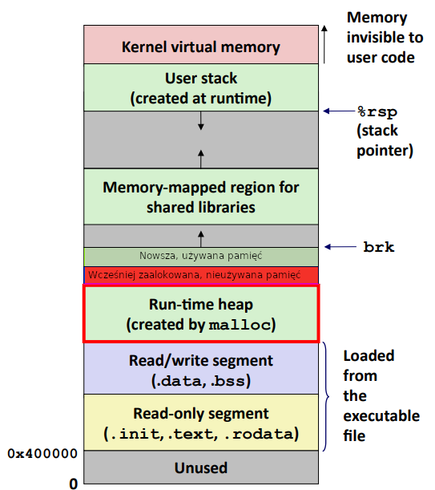

# Spis treści

- [Zadanie 1](#zadanie-1)
- Zadanie 2 - brak
- Zadanie 3 - brak
- Zadanie 4 - brak
- Zadanie 5 - brak
- Zadanie 6 - brak
- Zadanie 7 - brak
- Zadanie 8 - brak

***

# Zadanie 1

### Systemy uniksowe udostępniają wywołania systemowe [sbrk(2)](http://man7.org/linux/man-pages/man2/sbrk.2.html) oraz parę [mmap(2)](http://man7.org/linux/man-pages/man2/mmap.2.html) i [munmap(2)](http://man7.org/linux/man-pages/man2/munmap.2.html). Służą one do przydziału stron na użytek bibliotecznego algorytmu zarządzania pamięcią. Czemu implementacje [malloc(3)](http://man7.org/linux/man-pages/man3/malloc.3.html) preferują drugą opcję? Wyjaśnij to odwołując się do mapy pamięci wirtualnej procesu.

`malloc` preferuje użycie `mmap`+`munmap`, gdyż kiedy zaalokowany wcześniej obszar pamięci przestaje być potrzebny, to wówczas można zwolnić go przy użyciu wywołania `munmap`. W przypadku, gdy używane jest wywołanie `sbrk`, to można jedynie przesunąć koniec sterty, więc nie da się całkowicie zwolnić pamięci znajdującej się na początku sterty jeżeli dalej jest jakaś zaalokowana pamięć (`sbrk` w pewnym sensie działa jak push/pop na stosie).

W przypadku takim jak na rysunku, jeżeli `malloc` używa `sbrk`, to wówczas wcześniej zaalokowana, nieużywana pamięć (zaznaczona na czerwono) nie może zostać oddana systemowi operacyjnego dopóki nie zwolni się później zaalokowany obszar zaznaczone na zielono.

***

# Zadanie 2

### Wyjaśnij różnicę między <u>*fragmentacją wewnętrzną*</u> i <u>*zewnętrzną*</u>.

- **fragmentacja wewnętrzna** – następuje w przypadku, gdy rozmiar alokowanej pamięci jest mniejszy niż rozmiar jednego bloku. Wówczas nadmiarowa pamięć marnuje się.

- **fragmentacja zewnętrzna** – występuje gdy łączna suma wolnej pamięci jest wystarczająco duża do obsłużenia żądania alokacji, ale żaden z wolnych bloków nie jest wystarczająco duży i nie jest możliwa ich konsolidacja.

### Czemu nie można zastosować <u>*kompaktowania*</u> w bibliotecznym algorytmie przydziału pamięci?

**kompaktowanie** – defragmentacja zaalokowanej pamięci poprzez przeniesienie bloków tak, aby leżały obok siebie, co eliminuje fragmentację zewnętrzną.

Nie można zastosować **kompaktowania** w bibliotecznym algorytmie przydziału pamieci, gdyż **kompaktowanie** unieważnia stare wskaźniki (wskaźnik przestaje być poprawny, gdyż odpowiadająca mu pamięć została przeniesiona pod inny adres i nie ma możliwości automatycznego zaktualizowania tych wskaźników).

### Na podstawie §2.3 opowiedz o dwóch głównych przyczynach występowania fragmentacji zewnętrznej.

- *Fragmentation is caused by isolated deaths*: krytycznym problemem jest tworzenie wolnych obszarów, których sąsiadujące obszary nie są wolne. Składają się na to dwie rzeczy: które obiekty zostają umieszczone w przyległych obszarach, i kiedy te obiekty umierają. Jeżeli obiekty zostają zwolnione w rożnych momentach, to powstają pomiędzy nimi przerwy.

- *Fragmentation is caused by time-varying behavior*: fragmentacja powstaje przez to, że z upływem czasu może zmieniać się zachowanie programu w sensie tego, jakich alokacji dokonuje – np. zwalnianie małych bloków i alokowanie bardzo dużych, bądź alokowanie wielu obiektów różnych typów. Alokator powinien umieć zauważyć wzorce w alokacji w celu minimalizacji fragmentacji.

