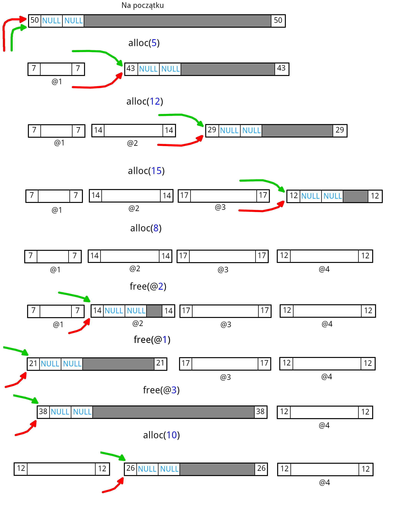

# Spis treści

- [Zadanie 1](#zadanie-1)
- Zadanie 2 – brak
- [Zadanie 3](#zadanie-3)
- Zadanie 4 – brak
- Zadanie 5 – brak

***

# Zadanie 1

### Algorytm przydziału pamięci udostępnia funkcje o sygnaturach $alloc: words \rightarrow @id$ i $free: @id \rightarrow void$ i ma do dyspozycji obszar 50 słów maszynowych. Implementacja używa dwukierunkowej listy wolnych bloków oraz boundary tags. Wyszukiwanie wolnych bloków działa zgodnie z polityką <u>*best-fit*</u>. Operacja zwalniania <u>*gorliwie złącza*</u> bloki i wstawia wolne bloki na początek listy.

- **best-fit** – podczas alokacji wyszukiwany jest pasujący blok o jak najmniejszym rozmiarze aby zminimalizować fragmentację.
- **gorliwe złączanie** – złączanie wolnych bloków od razu kiedy jest to możliwe a nie jedynie w razie potrzeby.

### Posługując się diagramem z wykładu wykonaj krokową symulację algorytmu przydziału pamięci dla poniższego ciągu żądań. Należy wziąć pod uwagę miejsce zajmowane przez struktury danych algorytmu przydziału oraz nieużytki.

Ciąg żądań:
```C
alloc(5) 
alloc(12) 
alloc(15) 
alloc(8) 
free(@2) 
free(@1) 
free(@3) 
alloc(10)
```

Zważywszy na to, że każdy blok ma posiadać boundary tags (header i footer) (oraz wskaźniki na poprzedni i kolejny wolny blok w przypadku wolnych bloków), to w takim razie najmniejszy możliwy rozmiar bloku jakiego możemy używać musi mieć rozmiar co najmniej 4 słów (jak na poniższym obrazku).


Symulacja przebiegu przydziałów pamięci (<span style="color: red">czerwona strzałka</span> – ostatni element listy, <span style="color: green">zielona strzałka</span> – pierwszy element listy. Strzałki wychodzą z zewnątrz):



*(wygląda podejrzanie bo nie powstało spaghetti ze strzałek ale może jest dobrze)*

***

# Zadanie 3

### Rozważmy <u>*algorytm kubełkowy*</u> (§3.6) (ang. *segregated-fit*) przydziału pamięci z <u>*gorliwym złączaniem*</u> wolnych bloków.

- **algorytm kubełkowy** – przechowujemy tablicę list wolnych bloków w taki sposób, że każda z list przechowuje wolne bloki o konkretnym rozmiarze. Kiedy blok zostaje zwolniony, to zostaje dołączony do listy bloków tego rozmiaru. Kiedy żądana jest alokacja, to wybiera się blok z odpowiedniej, jak najmniejszej listy.

- **gorliwe złączanie** – [było](#zadanie-1)

### Jak przebiegają operacje `malloc` i `free`?

*(zakładamy, że mamy kubełki dla rozmiarów będących kolejnymi potęgami 2)*

- `malloc(n)`:
    1) wybierz taki kubełek, że przechowywana w nim lista przechowuje bloki o najmniejszym rozmiarze większym lub równym `n`
    2) jeżeli kubełek zawiera wolny blok, to usuń go z listy wolnych bloków, oznacz jako zajęty i zwróć wskaźnik na niego
    3) jeżeli kubełek był pusty, to szukaj bloku w kolejnym kubełku.
        4) jeżeli wszystkie kubełki były puste to zaalokuj nową stronę i wypełnij ją wolnymi blokami o szukanym rozmiarze
        5) jeżeli znaleziono wolny blok to podziel go. Blok z pozostałym miejscem umieść na odpowiedniej liście wolnych bloków. Oznacz zaalokowany blok jako zajęty.
- `free(ptr)`:
    1) oznacz blok jako wolny
    2) jeżeli sąsiadujący blok jest wolny to połącz go ze zwalnianym blokiem (powtarzać do skutku) i przenieś do odpowiedniej listy wolnych bloków.

###  Co robi `malloc`, gdy na danej liście nie ma wolnego bloku żądanego rozmiaru?

Szuka bloku o większym rozmiarze (który następnie podzieli). Jeżeli w ogóle nie ma dostatecznie dużych wolnych blokow to następuje alokacja nowej strony, którą wypełnia się (na przykład) blokami szukanego rozmiaru.

### Jak poradzić sobie w trakcie złączania wolnych bloków w procedurze `free`, jeśli chcemy usunąć ostatni element z listy? 

Jeżeli zwalniamy blok, który jest ostatni w swoim kubełku, to wówczas nie dzieje się nic specjalnego. Lista staje się pusta i tyle. *(nie rozumiem gdzie miałby być problem xd)*.

### Rozważ zastosowanie <u>*leniwego złączania*</u> wolnych bloków w algorytmie kubełkowym przydziału pamięci – jakie problemy zauważasz?

- **złączanie leniwe** – konsolidacja bloków następuje dopiero w momencie kolejnej alokacji (i nie napotkaliśmy jeszcze bloku o odpowiednio dużym rozmiarze).

Leniwe złączanie zmniejsza czas wyszukiwania bloków gdy chcemy dokonywać małych alokacji: przy złączaniu gorliwym małe bloki zostają skonsolidowane i w większości przypadków trzeba szukać miejsca wśrod tych większych. Leniwe złączanie pozwala również przenieść ciężar pracy ze zwalniania na alokowanie nowych obiektów.

Problemy: komplikuje algorytm alokacji? *(ja nie zauważam żadnych)*.